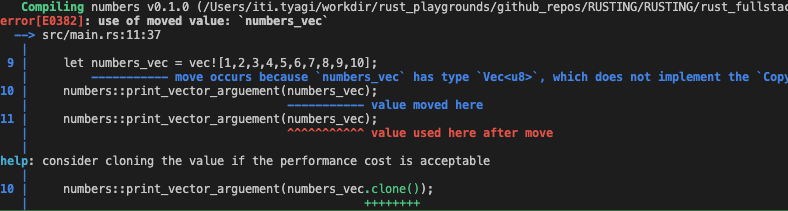

Some errors and how they are appearing and logic behind them

Let’s us see what happens when passing a non-Copy
type to a function. While arrays implement the Copy trait if their elements do, Vec
does not. Hence, try adding another call to print_vector_arguement(numbers) after the first
one:

